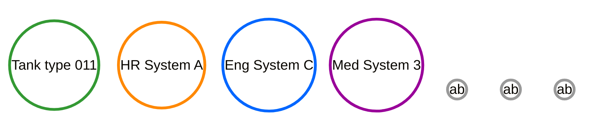

# Some basic needs
{: .fs-9 .no_toc }

Exploring some fundamental user needs
{: .fs-6 .fw-300 }
----

The MOD is used here as a concrete example to explore socio-related user needs.  This perspective has persisted despite Project CONCRETE now spanning all areas of government, business, academia, and society.  A common Project CONCRETE theme has emerged over time: attempt to enable people involved in the hardest, harshest, most dynamic extremes and everything else tends to follow.

These are by no means the only user needs, nor are they the most important.  They simply act as a useful starting point for this journey. 

## Table of contents
{: .no_toc }

1. TOC
{:toc}

## A single ecosystem for collaboration and teamwork

Personnel currently achieve great things despite their digital systems not because of them. Unfortunately people are used to their systems being 'stovepiped' or 'siloed'.  The diagram below depicts just 4 indicative systems, in reality there are thousands (globally, millions).  These stovepipes act as barriers to efficiency, digital cooperation, and teamwork.     

There are many reasons, some particularly subtle, for these stovepipes, but the dominant factor here is that each of the systems has been built independently.  Without a common standard, development teams are free to make innumerable design decisions.  Indeed, they are forced to do so. All of these design decisions create barriers and incompatibilities.

{: .note-title}
> Note
>
> It is very tempting to seek to correct the situation depicted above by developing 'bridges' or 'translators' to join disparate systems. This approach is doomed to long-term failure - discussed in detail LINK-here

Users need a single ecosystem that technically minimises any and all barriers to efficiency, cooperation, and teamwork (depicted below [^misleading] ). This single ecosystem will primarily be generated by adopting a common socio-technical foundation developed by Pj CONCRETE. Barriers will still exist, but should be a result of human (socio-) choice.  The extent to which this is possible is a function of need,trust, and sometimes law and is discussed at greater length LINK-here. 

[^misleading]:
    **Caution**:  This diagram is subtly misleading.  The diagram suggests that the limit to our ambition should conform to current organisational boundaries; in this case, the MOD.  This is not the case.  The actors could clearly be replaced by NHS or industry or school equivalents.  Less obviously this could be expanded to include all-of-the-above and more. These groups might not interact much in practice, but the principle should be to enable any future cooperation or teamwork opportunity.      

{: .note-title}
> Note
>
> One of the current major causes of boundaries between systems is **Security**. The majority of the technical side of Project CONCRETE is associated with using digital technology to substantially enhance security by better supporting end users with their actual needs.  This introduces new socio-technical approaches to LINK-information, LINK-data, and LINK-physical security.  Security boundaries are still incredibly important, but 'digital' enables far more sophisticated tools and approaches than those from the paper era.

## Understandability and predictability

It is impossible to get the most out of a tool that you don't understand and can't predict.  To act efficiently and effectively in the world, people need to be able to reason about the consequences of actions and events.  Inaccurate understanding and reasoning leads to people taking inappropriate risks - either too much (leading to shock failures, and at the extreme, death) or too little (leading to, often unrecognised, underperformance). Whatever this system is, **it needs to be based on a small number of easy to understand principles** (easy for all humans, not just specialists). 

For this same reason, in a single collaborative environment it is also important to guard against the potential for one user's actions to inappropriately effect someone else; there should be no unknown ghosts playing tricks in the machine. 

## Enabling dynamic risk management in a dynamic world

Risk-reward balances are continuously changing in a dynamic world. Something that is entirely appropriate at one moment may become wholly inappropriate the next. This is related to the reasoning behind the military leadership style of 'mission command' (or subsidiarité) whereby subordinates make decisions and act independently within a commander's established intent, promoting flexibility and speed in complex situations.  The power here comes from people making local risk-reward choices. 

## Distributed and decentralised

Centralised network approaches pre-bake risk into a system.  There is nothing wrong with centralisation itself; it is commonly useful to achieve an efficiency/effectiveness goal.  What matters is how this is achieved.  It is always possible to overlay a centralised approach on a fundamentally distributed and decentralised system.  The reverse is not true.  Resiliency and redundancy are powerful local risk management tools, they need to be available as the norm not the exception.

